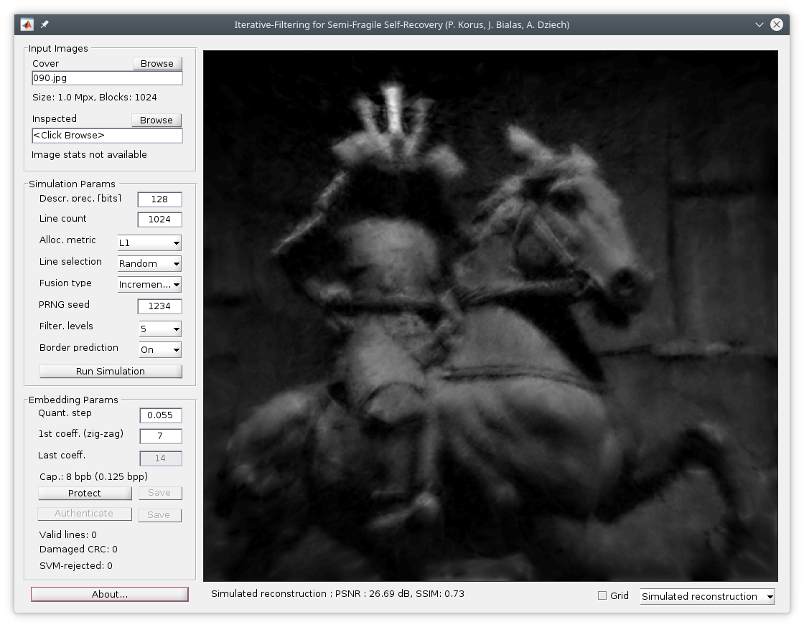
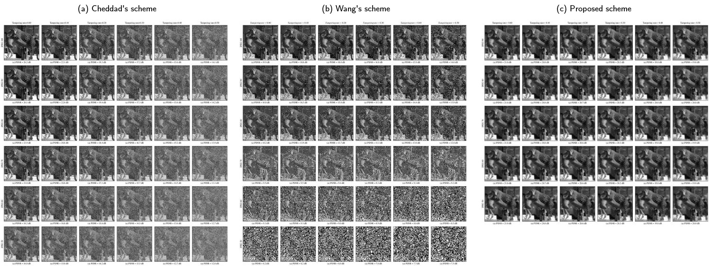

Supplementary materials for:

- P. Korus, J. Białas, A. Dziech, *Iterative Filtering for Semi-Fragile Self-Recovery*, IEEE International Workshop on Information Forensics & Security, 2014, [doi: 10.1109/WIFS.2014.7084300](http://dx.doi.org/10.1109/WIFS.2014.7084300), [Pre-print](http://kt.agh.edu.pl/~korus/files/4114/3843/6757/2014-WIFS-Semi-Fragile-Self-Recovery.pdf)

The proposed method allows for approximate self-recovery of image content based on tampered image copy alone. The image needs to be previously protected with a digital watermark. The scheme is very robust and works even after JPEG compression or brightness adjustments.

This package contains a Matlab implementation with a simple graphical user interface (see `demo.m`). This demonstration is a simple illustration of the general principles - it is not suitable for production use. We have a more suitable, low-level implementation in C++. Please get in touch if you are interested.

The scheme compares favorably with state-of-the-art methods. The robustness evaluation grids shown below, illustrate the reconstruction quality for various combinations of tampering rates (up to 50% of the image area) and JPEG compression factors (down to 50). We compared three schemes:

- A. Cheddad, A. Condell, K. Curran, and P. Mc Kevitt, *A secureand improved self-embedding algorithm to combat digital documentforgery*, Signal Processing, vol. 89, pp. 2324–2332, 2009.
- H. Wang, A. T. S. Ho, and X. Zhao, *A novel fast self-restoration semi-fragile watermarking algorithm for image content authentication resistant to JPEG compression*, in Proc. 10th Int. Conf. on Digital-Forensics andWatermarking, 2012.
- The proposed scheme based on iterative filtering.

## Links

- Robustness evaluations grids in higher resolution for 30 images can be obtained here: [wifs-robustness-grids.zip](http://kt.agh.edu.pl/~korus/index.php/download_file/view/32/112/) (64 MB).
- Our image dataset (100 1Mpx gray-scale photographs) can be obtained here: [wifs-2014-testset.zip](http://kt.agh.edu.pl/~korus/index.php/download_file/view/27/112/) (55 MB)

## License

Personal use for educational and research purposes is permitted. Any other use, including commercial purposes, is strictly prohibited. The code is provided "as-is", without warranties of any kind.

## Acknowledgement

The research leading to these results received funding from the European Regional Development Fund under INSIGMA project no. POIG.01.01.02-00-062/09. 
